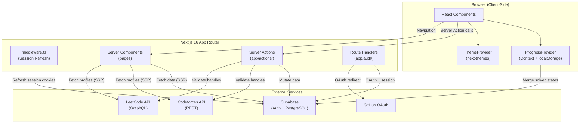
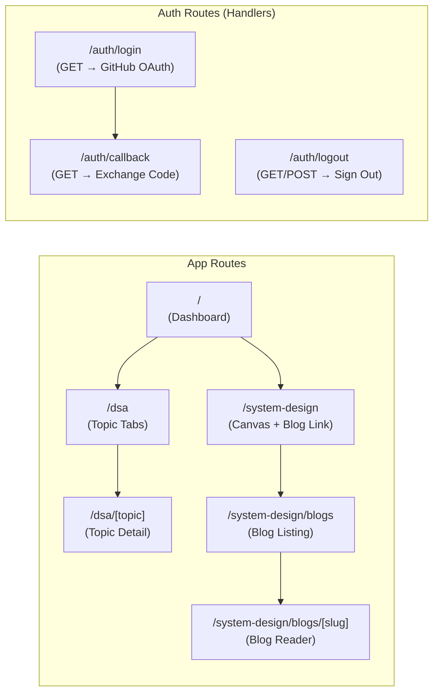
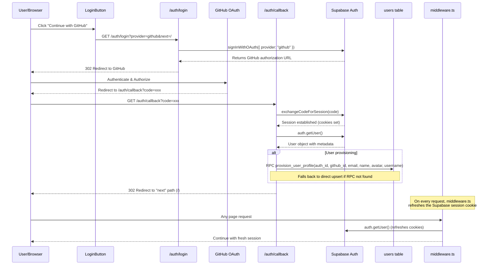
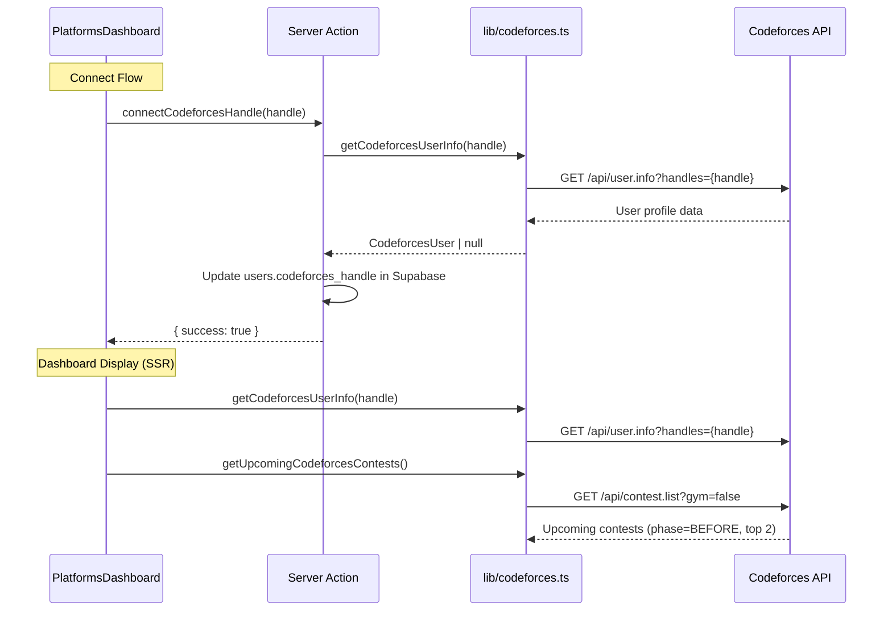
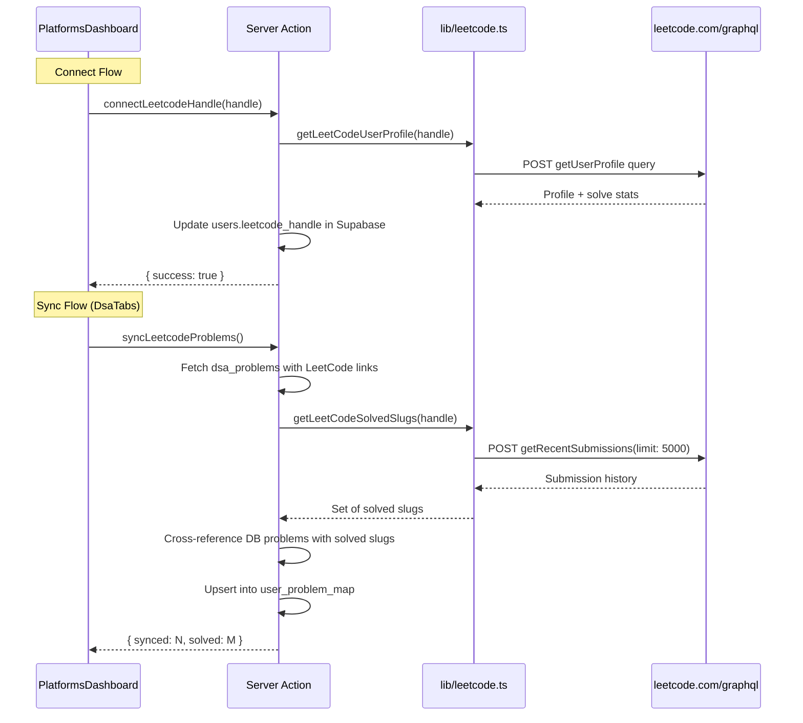
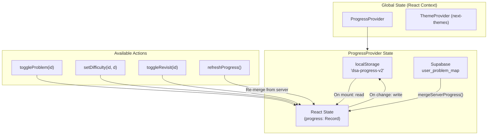
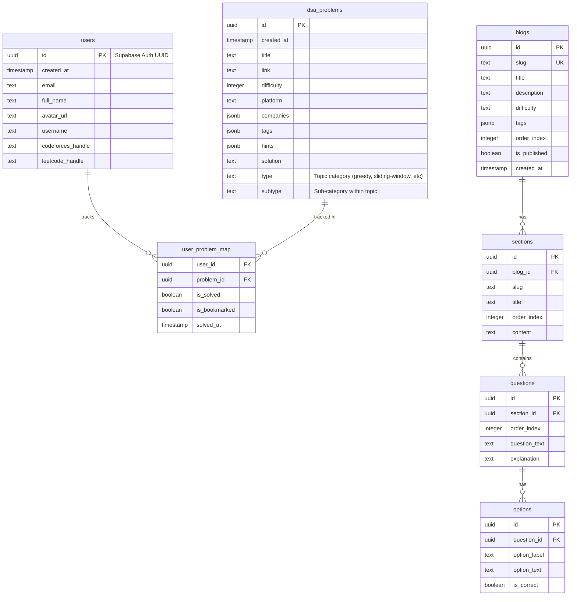
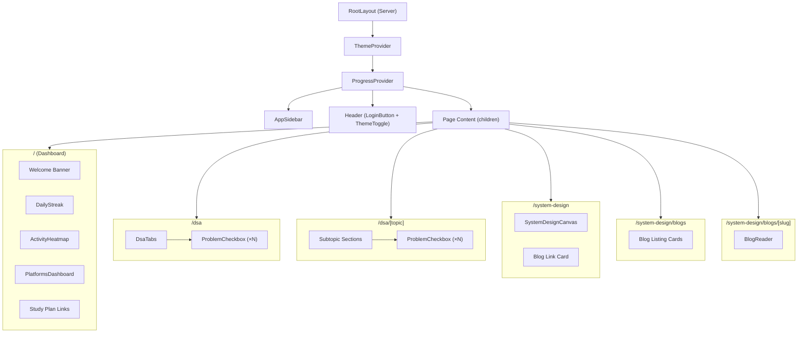

# ProTrainer (mentor_me) — Codebase Deep Dive

> A full-stack coding practice platform built with **Next.js 16**, **React 19**, **Supabase**, and **Tailwind CSS v4**. Features DSA problem tracking, system design blogs with quizzes, an interactive canvas, and platform integrations for Codeforces, LeetCode & GitHub.

---

## Table of Contents

1. [Tech Stack](#tech-stack)
2. [File Structure](#file-structure)
3. [Architecture Overview](#architecture-overview)
4. [Routing Map](#routing-map)
5. [Authentication Flow](#authentication-flow)
6. [API Integrations](#api-integrations)
7. [State Management](#state-management)
8. [Database Schema](#database-schema)
9. [Component Hierarchy](#component-hierarchy)
10. [Design System — Neumorphic Soft UI](#design-system--neumorphic-soft-ui)
11. [Key Files Reference](#key-files-reference)

---

## Tech Stack

| Layer | Technology |
|---|---|
| Framework | Next.js 16 (App Router) |
| UI | React 19, Lucide Icons |
| Styling | Tailwind CSS v4, Vanilla CSS custom properties |
| Auth | Supabase Auth (GitHub OAuth) |
| Database | Supabase (PostgreSQL) |
| APIs | Codeforces REST, LeetCode GraphQL |
| Diagramming | @xyflow/react (React Flow) |
| Heatmap | react-activity-calendar |
| Syntax Highlight | react-syntax-highlighter |
| Theming | next-themes |

---

## File Structure

```
mentor_me/
├── app/                          # Next.js App Router root
│   ├── layout.tsx                # Root layout (ThemeProvider, ProgressProvider, AppSidebar, header)
│   ├── page.tsx                  # Dashboard homepage (server component)
│   ├── loading.tsx               # Global loading fallback
│   ├── globals.css               # Design system tokens + Neumorphic utilities
│   │
│   ├── actions/                  # Next.js Server Actions
│   │   ├── codeforces.ts         #   → connectCodeforcesHandle()
│   │   └── leetcode.ts           #   → connectLeetcodeHandle(), syncLeetcodeProblems()
│   │
│   ├── auth/                     # Authentication route handlers
│   │   ├── login/route.ts        #   → GET: Initiate GitHub OAuth
│   │   ├── callback/route.ts     #   → GET: Exchange code, provision user profile
│   │   ├── logout/route.ts       #   → GET/POST: Sign out and redirect
│   │   └── debug/route.ts        #   → Debug endpoint for auth troubleshooting
│   │
│   ├── dsa/                      # DSA study plan pages
│   │   ├── page.tsx              #   → Topic listing with tabbed interface
│   │   └── [topic]/page.tsx      #   → Dynamic topic detail page
│   │
│   ├── system-design/            # System design feature
│   │   ├── page.tsx              #   → Canvas + blog entry point
│   │   └── blogs/
│   │       ├── page.tsx          #   → Blog listing page
│   │       └── [slug]/page.tsx   #   → Blog reader (sections + quizzes)
│   │
│   └── utils/supabase/           # Supabase client factories
│       ├── server.ts             #   → Server-side Supabase client (cookie-based)
│       ├── client.ts             #   → Browser-side Supabase client
│       └── middleware.ts         #   → Session refresh middleware helper
│
├── components/                   # Shared React components
│   ├── AppSidebar.tsx            # Desktop sidebar with domain selector + nav
│   ├── ActivityHeatmap.tsx       # GitHub-style contribution heatmap
│   ├── DailyStreak.tsx           # Streak counter widget
│   ├── PlatformsDashboard.tsx    # Codeforces / LeetCode / GitHub profile cards
│   ├── DsaTabs.tsx               # Tabbed topic navigator + LeetCode sync button
│   ├── ProblemCheckbox.tsx       # Interactive problem row (check, difficulty, hints, solution)
│   ├── TopicProgressCard.tsx     # Topic completion progress card
│   ├── ProgressProvider.tsx      # Global progress context (localStorage + Supabase merge)
│   ├── ThemeProvider.tsx         # next-themes wrapper
│   ├── ThemeToggle.tsx           # Light/dark mode toggle button
│   ├── CodeSnippet.tsx           # Syntax-highlighted code block
│   ├── auth/
│   │   └── LoginButton.tsx       # Login/logout button with modal
│   └── system-design/
│       ├── SystemDesignCanvas.tsx # @xyflow/react interactive diagramming canvas
│       └── BlogReader.tsx        # Section-based blog renderer with inline quizzes
│
├── lib/                          # Data fetching & business logic
│   ├── codeforces.ts             # Codeforces API client (user info, upcoming contests)
│   ├── leetcode.ts               # LeetCode GraphQL client (profile, solved slugs)
│   ├── dsa.ts                    # Supabase DSA problem fetcher + topic grouping
│   ├── system-design.ts          # Supabase blog/section/quiz fetcher
│   ├── data.ts                   # Static DSA topic data with pseudocode templates
│   └── url.ts                    # URL utilities (base URL detection)
│
├── middleware.ts                 # Next.js middleware → Supabase session refresh
├── supabase/migrations/          # Database migration files
├── package.json                  # Dependencies & scripts
└── next.config.ts                # Next.js configuration
```

---

## Architecture Overview



---

## Routing Map



| Route | Type | Rendering | Description |
|---|---|---|---|
| `/` | Page | Server (async) | Dashboard: welcome, streak, heatmap, platform cards, study plan links |
| `/dsa` | Page | Server (async) | Fetches `dsa_problems` from Supabase, renders `DsaTabs` |
| `/dsa/[topic]` | Page | Server (async) | Dynamic topic detail with subtopic grouping and `ProblemCheckbox` |
| `/system-design` | Page | Static | Interactive canvas (`@xyflow/react`) + link to blogs |
| `/system-design/blogs` | Page | Server (async) | Lists published blogs from Supabase |
| `/system-design/blogs/[slug]` | Page | Server (async) | Blog reader with sections + inline MCQ quizzes |
| `/auth/login` | Route Handler | — | Initiates GitHub OAuth via Supabase |
| `/auth/callback` | Route Handler | — | Exchanges auth code, provisions user row in `users` table |
| `/auth/logout` | Route Handler | — | Signs out user, clears session cookies |

---

## Authentication Flow



### Key Auth Files

| File | Purpose |
|---|---|
| `components/auth/LoginButton.tsx` | Client component: Login/logout UI with modal. Redirects to `/auth/login` |
| `app/auth/login/route.ts` | Initiates OAuth with Supabase, redirects to GitHub |
| `app/auth/callback/route.ts` | Exchanges code for session, provisions/upserts `users` row |
| `app/auth/logout/route.ts` | Calls `supabase.auth.signOut()`, clears cookies |
| `app/utils/supabase/middleware.ts` | Called by `middleware.ts` to silently refresh session tokens |
| `app/utils/supabase/server.ts` | Cookie-based Supabase client for Server Components / Actions |
| `app/utils/supabase/client.ts` | Browser Supabase client for client-side queries |

---

## API Integrations

### Codeforces (REST API)



**Endpoints Used:**

| Endpoint | Purpose |
|---|---|
| `GET /api/user.info?handles={handle}` | Fetch user profile (rating, rank, avatar) |
| `GET /api/contest.list?gym=false` | Fetch upcoming contests (filtered to `BEFORE` phase) |

**Types:** `CodeforcesUser`, `CodeforcesContest` (defined in `lib/codeforces.ts`)

---

### LeetCode (GraphQL API)



**GraphQL Queries:**

| Query | Purpose |
|---|---|
| `getUserProfile($username)` | Fetch ranking, reputation, solve count by difficulty |
| `getRecentSubmissions($username, $limit)` | Fetch up to 5000 recent submissions to determine solved problems |

**Types:** `LeetCodeUser` (defined in `lib/leetcode.ts`)

---

### Supabase (Database + Auth)

All Supabase interaction is through the `@supabase/ssr` client. There are three client flavors:

| Client | File | Usage |
|---|---|---|
| **Server** | `app/utils/supabase/server.ts` | Server Components, Server Actions — uses `cookies()` |
| **Browser** | `app/utils/supabase/client.ts` | Client Components — uses `createBrowserClient` |
| **Middleware** | `app/utils/supabase/middleware.ts` | Middleware — cookie refresh on every request |

**Tables accessed:**

| Table | Operations | Used By |
|---|---|---|
| `users` | SELECT, UPDATE, UPSERT | Auth callback, server actions, home page |
| `dsa_problems` | SELECT | `lib/dsa.ts` |
| `user_problem_map` | SELECT, UPSERT | LeetCode sync action, ProgressProvider |
| `blogs` | SELECT | `lib/system-design.ts` |
| `sections` | SELECT | `lib/system-design.ts` |
| `questions` + `options` | SELECT (joined) | `lib/system-design.ts` |

---

## State Management



### ProgressProvider — The Core State Engine

**Location:** `components/ProgressProvider.tsx`

The `ProgressProvider` is a React Context that wraps the entire app. It manages per-problem tracking state with a **hybrid local + server** approach:

**Data Shape:**

```typescript
type ProblemProgress = {
  date?: string;        // YYYY-MM-DD (when solved)
  difficulty?: 'easy' | 'medium' | 'hard';
  revisit?: boolean;    // bookmarked for revisit
  lcSynced?: boolean;   // true if solved via LeetCode sync
};

type ProgressData = Record<string, ProblemProgress>; // keyed by problem ID
```

**Initialization Flow:**

```
1. Mount ProgressProvider
2. Read "dsa-progress-v2" from localStorage
   └── If missing, migrate from legacy "dsa-progress" format
3. Call mergeServerProgress():
   └── Fetch user_problem_map from Supabase (if logged in)
   └── Merge is_solved → date + lcSynced flag
   └── Merge is_bookmarked → revisit flag
   └── Write merged result back to localStorage
4. Set React state + isMounted = true
```

**Actions exposed via `useProgress()` hook:**

| Action | Behavior |
|---|---|
| `toggleProblem(id)` | Toggle solved state, stamps today's date |
| `setDifficulty(id, d)` | Set user-perceived difficulty (easy/medium/hard) |
| `toggleRevisit(id)` | Toggle bookmark for revisit |
| `refreshProgress()` | Re-read localStorage + re-merge from Supabase |

### ThemeProvider

**Location:** `components/ThemeProvider.tsx`

Thin wrapper over `next-themes/ThemeProvider`. Configured in `layout.tsx` with:
- `attribute="class"` — applies `dark` class to `<html>`
- `defaultTheme="system"` — respects OS preference
- `enableSystem` — auto-detect OS theme

---

## Database Schema

Based on the queries and types used across the codebase:



---

## Component Hierarchy



### Server vs Client Components

| Component | Type | Why |
|---|---|---|
| `RootLayout` | Server | Fetches auth user from Supabase |
| `AppSidebar` | Client | Uses `usePathname()`, `useState` for dropdown |
| `LoginButton` | Client | Modal state, form submission |
| `ThemeToggle` | Client | Theme switching logic |
| `ProgressProvider` | Client | React Context, localStorage, Supabase browser client |
| `DsaTabs` | Client | Tab switching, LeetCode sync action call |
| `ProblemCheckbox` | Client | Interactive check/difficulty/revisit/hints/solution |
| `PlatformsDashboard` | Client | Handle connection forms, server action calls |
| `ActivityHeatmap` | Client | Calendar rendering |
| `DailyStreak` | Client | Streak calculation |
| `SystemDesignCanvas` | Client | @xyflow/react requires client-side rendering |
| `BlogReader` | Client | Quiz interaction state |
| DSA pages | Server | Fetch data from Supabase SSR |
| Blog pages | Server | Fetch data from Supabase SSR |

---

## Design System — Neumorphic Soft UI

The app uses a custom **Neumorphic (Soft UI)** design system defined in `globals.css`.

### CSS Custom Properties (Tokens)

| Token | Light | Dark | Purpose |
|---|---|---|---|
| `--bg-color` | `#f8fafc` | `#0c1222` | Base background |
| `--text-color` | `#475569` | `#94a3b8` | Body text |
| `--heading-color` | `#0f172a` | `#f8fafc` | Headings |
| `--nm-shadow` | Light raised shadow | Dark raised shadow | Flat/raised elements |
| `--nm-inset` | Light inset shadow | Dark inset shadow | Pressed/inset elements |

### Utility Classes

| Class | Effect |
|---|---|
| `.nm-flat` | Raised surface with neumorphic shadow + subtle border |
| `.nm-flat-sm` | Smaller raised surface |
| `.nm-inset` | Sunken/pressed surface |
| `.nm-inset-sm` | Smaller sunken surface |
| `.nm-button` | Interactive button with press animation |
| `.nm-button:active` | Inset shadow + translateY on press |

### Color Palette

- **Primary accent:** `orange-500` (links, active states, branding)
- **Success/Correct:** `emerald-500` / `green-500`
- **Error/Incorrect:** `rose-500` / `red-500`
- **Warning/Bookmark:** `amber-500`
- **Platform colors:** `blue-500` (Codeforces), `yellow-500` (LeetCode)

### Typography

| Font | Variable | Usage |
|---|---|---|
| Geist Sans | `--font-geist-sans` | Body text, headings |
| Geist Mono | `--font-geist-mono` | Code blocks, handles |

---

## Key Files Reference

| File | Size | Purpose |
|---|---|---|
| `app/layout.tsx` | 92 lines | Root layout — auth check, providers, sidebar, header |
| `app/page.tsx` | 135 lines | Dashboard — SSR data fetching for all platform cards |
| `app/actions/leetcode.ts` | 181 lines | Connect handle + sync solved problems from LeetCode |
| `app/actions/codeforces.ts` | 66 lines | Connect Codeforces handle |
| `app/auth/callback/route.ts` | 124 lines | OAuth callback with user provisioning |
| `components/ProgressProvider.tsx` | 169 lines | Global progress state engine |
| `components/PlatformsDashboard.tsx` | 362 lines | Platform connection UI + stats display |
| `components/ProblemCheckbox.tsx` | 254 lines | Full-featured problem interaction row |
| `components/DsaTabs.tsx` | 134 lines | Topic tabs + LeetCode sync button |
| `components/AppSidebar.tsx` | 124 lines | Navigation sidebar with domain selector |
| `lib/dsa.ts` | 249 lines | DSA problem fetching + topic grouping logic |
| `lib/leetcode.ts` | 193 lines | LeetCode GraphQL client |
| `lib/system-design.ts` | 138 lines | Blog/section/quiz data fetching |
| `lib/codeforces.ts` | 66 lines | Codeforces REST API client |
| `lib/data.ts` | 363 lines | Static DSA topic data with pseudocode templates |
| `globals.css` | 163 lines | Neumorphic design system + blog/quiz styles |
